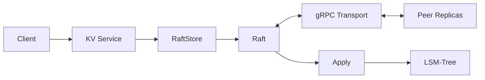

# Mizu

Mizu is a distributed key-value store with a Go distributed systems layer, built around a **custom Raft implementation** and a **custom C++17 LSM-Tree storage engine**.

It is an experimental project for exploring the core building blocks of distributed storage systems: **consensus, replicated state machines, linearizable reads, persistent storage, snapshots, and compaction**.

> **Status:** Experimental. Not production-ready.

## Highlights

- **Custom Raft** — leader election, log replication, commit advancement, snapshot transfer, and log compaction
- **Linearizable Reads** — `ReadIndex`-based reads without replicating every read through the Raft log
- **RaftStore-style Execution** — separates consensus, persistence, transport, and state-machine application
- **Custom LSM-Tree** — WAL, SkipList MemTable, SSTable, Bloom filter, Manifest, and multi-level compaction
- **MVCC-style Storage** — sequence-number-based snapshot reads and obsolete-version cleanup
- **gRPC Transport** — client RPCs and communication between Raft replicas

## Architecture



The system separates the distributed consensus path from the local storage engine.

For writes, Raft first establishes consensus on an operation. The committed entry is then applied to the local state machine.

```text
Client
  ↓
KV Service
  ↓
RaftStore
  ↓
Raft Proposal
  ↓
Replicate to Quorum
  ↓
Commit
  ↓
Apply
  ↓
Storage Engine
```

## Raft

Mizu implements the core Raft protocol instead of wrapping an existing Raft library.

The implementation includes:

- randomized leader election
- `RequestVote` and log freshness checks
- `AppendEntries` log replication
- per-follower `Match` / `Next` progress tracking
- conflict detection and log rollback
- quorum-based commit advancement
- persistent `HardState`
- snapshot generation, transfer, and restore
- log compaction
- `Ready / Advance`-style integration with the upper storage layer
- `ReadIndex` for linearizable reads

Raft is responsible for deciding **which log entries are committed**. State-machine application is handled separately by the RaftStore layer.

## Linearizable Reads

Normal reads do not need to be appended as Raft log entries.

Mizu uses `ReadIndex` to confirm that the current leader still has quorum authority and to obtain a safe committed index.

The read is served only after:

```text
appliedIndex >= readIndex
```

This ensures that the local state machine contains every write that must be visible to the read.

```text
GET
 ↓
ReadIndex
 ↓
Quorum Confirmation
 ↓
Wait for appliedIndex
 ↓
Read Local Storage
```

## LSM-Tree

Mizu contains a custom C++17 LSM-Tree implementation under `engine/lsmtree`. The Go service accesses it through a small cgo binding in `internal/lsmtree`.

```text
                 ┌───────────┐
Write ──> WAL ──>│ MemTable  │
                 └─────┬─────┘
                       ↓ flush
                 ┌───────────┐
                 │  SSTable  │
                 └─────┬─────┘
                       ↓
                  L0 → L1 → L2
                     Compaction
```

The storage engine implements the major components of an LSM-based KV engine:

- **WAL** with CRC32C and recovery replay
- **Arena-backed SkipList MemTable**
- **InternalKey + Sequence Number** for multi-version records
- **SSTable** with prefix-compressed keys and restart points
- **Index Blocks** for locating data blocks
- **Bloom Filters** for avoiding unnecessary SSTable reads
- **Manifest** for persistent version metadata
- **Multi-level Compaction** from L0 to L1 and L1 to L2
- **Snapshot Reads** based on sequence numbers
- snapshot-aware obsolete-version cleanup during compaction

## RaftStore

`RaftStore` bridges the Raft state machine and the KV storage layer.

It is responsible for:

```text
Tick Raft
   ↓
Handle Messages / Proposals
   ↓
Get Ready
   ↓
Persist Raft State and Entries
   ↓
Send Raft Messages
   ↓
Apply Committed Entries
   ↓
Advance
```

This keeps the Raft implementation independent from transport and application logic.

## Quick Start

### Requirements

- Linux
- Go 1.24+
- CMake 3.20+
- a C++17 compiler
- cgo enabled
- `protoc` only when regenerating protobuf definitions

### Build

```bash
make build
```

`make build` first compiles the C++ LSM-Tree into `engine/lsmtree/build/liblsmtree.a`, then links it into the Go server through cgo and builds:

```text
bin/mizu
bin/mizu-client
```

The equivalent manual build is:

```bash
make lsmtree
mkdir -p bin
go build -o bin/mizu ./cmd/mizu
go build -o bin/mizu-client ./cmd/mizu-client
```

### Run a Single Node

```bash
./bin/mizu \
  --engine lsm \
  --id 1 \
  --cluster 1 \
  --addr :2008 \
  --raft-addr :3001 \
  --db /tmp/mizu \
  --peers 1@127.0.0.1:3001
```

Then run the example client in another terminal:

```bash
./bin/mizu-client --servers 1@127.0.0.1:2008
```

`lsm` is the default storage engine, so `--engine lsm` is optional. The Badger-backed implementation remains available for comparison with `--engine badger`.

### Run a 3-Node Cluster

```bash
# node 1
./bin/mizu --engine lsm --id 1 --cluster 1 \
  --addr :2008 --raft-addr :3001 --db /tmp/mizu \
  --peers 1@127.0.0.1:3001,2@127.0.0.1:3002,3@127.0.0.1:3003

# node 2
./bin/mizu --engine lsm --id 2 --cluster 1 \
  --addr :2009 --raft-addr :3002 --db /tmp/mizu \
  --peers 1@127.0.0.1:3001,2@127.0.0.1:3002,3@127.0.0.1:3003

# node 3
./bin/mizu --engine lsm --id 3 --cluster 1 \
  --addr :2010 --raft-addr :3003 --db /tmp/mizu \
  --peers 1@127.0.0.1:3001,2@127.0.0.1:3002,3@127.0.0.1:3003
```

Then run:

```bash
./bin/mizu-client
```

The server appends `-<node-id>` to the value passed through `--db`, so the commands above use `/tmp/mizu-1`, `/tmp/mizu-2`, and `/tmp/mizu-3` as their actual database directories.

## Project Layout

```text
Mizu/
├── cmd/
│   ├── mizu/               # Server entrypoint
│   └── mizu-client/        # Example client entrypoint
├── client/                 # Retrying client library and Region route cache
├── raft/                   # Custom Raft implementation
├── kv/
│   ├── node/               # Node lifecycle, KV RPCs, and key routing
│   ├── raftstore/          # Multi-Raft execution, Ready, Apply, and snapshots
│   ├── region/             # Region metadata and range management
│   ├── storage/            # RegionStorage and RaftStorage implementations
│   └── transport/          # Raft gRPC transport
├── engine/
│   └── lsmtree/            # Custom C++17 LSM-Tree storage engine
├── internal/
│   └── lsmtree/            # cgo binding for the LSM-Tree
├── proto/                  # Protobuf and gRPC definitions
├── Makefile
└── go.mod
```

## Development

Build the C++ engine and run both the C++ and Go test suites:

```bash
make test
```

After the LSM-Tree library has been built, the Go tests can also be run directly:

```bash
go test ./...
```

Regenerate protobuf code:

```bash
make proto
```

## Current Status

Mizu currently focuses on the core path of a distributed KV system:

```text
Request → Consensus → Commit → Apply → Persistent Storage
```

The project is still evolving. Automatic Region split and merge, more complete multi-Region management, fault injection, observability, and systematic benchmarking remain future work.

Regions are currently created statically with these ranges:

```text
[]  → "m"
"m" → "t"
"t" → []
```

## Motivation

Mizu is built to understand distributed storage systems below the API layer.

Instead of only combining existing components, the project explores how **Raft consensus, replicated state machines, and an LSM-Tree storage engine** interact to turn a client request into durable, replicated state.
